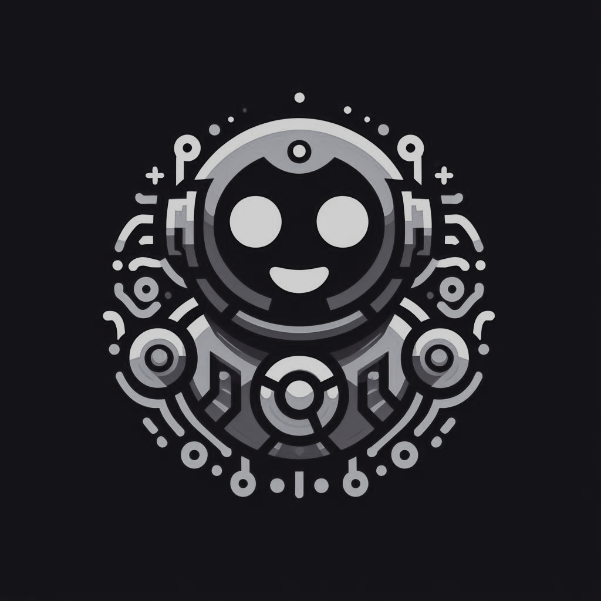

# UnityBot

UnityBot is a multipurpose Discord bot designed to enhance your server's community management, entertainment, and moderation capabilities. With UnityBot, you can effortlessly manage server operations, engage members with fun activities, and maintain a healthy and welcoming environment for everyone.

## Features

- **Community Management**: Streamline administrative tasks such as user management and channel configuration.
- **Entertainment**: Keep members entertained with interactive games, quizzes, and polls.
- **Moderation**: Ensure a safe and friendly atmosphere by moderating conversations and enforcing rules.
- **Customization**: Tailor UnityBot to your server's needs with configurable settings and modular functionality.

## Getting Started

To get started with UnityBot, [invite it to your Discord server](<bot_invite_link>) and configure its permissions. Use the `!help` command to explore available features and enjoy a seamless Discord community experience!

## Contributing

Contributions to UnityBot are welcome! Whether it's adding new features, fixing bugs, or improving documentation, we appreciate any contributions from the community. Simply fork the repository, make your changes, and submit a pull request.

## Feedback and Support

Have feedback, suggestions, or need assistance with UnityBot? Feel free to [open an issue](<link_to_issues_page>) on GitHub or join our [Discord server](<discord_server_invite_link>) for community support.

## License

UnityBot is licensed under the [MIT License](LICENSE), allowing you to use, modify, and distribute the software freely. See the [LICENSE](LICENSE) file for more details.